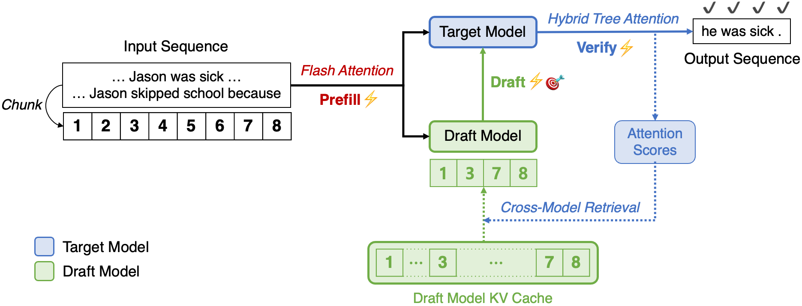

<h1 align="center">
  
  SpecExtend: A Drop-in Enhancement for Speculative Decoding of Long Sequences
</h1>

<p align="center">
  
</p>


## Introduction

While speculative decoding has emerged as an effective, lossless solution to accelerating LLM inference, its performance degrades significantly for even moderately long inputs. This is due to:

1. **Increased latency** in both drafting and verification steps due to the quadratic complexity of standard attention.
2. **Reduced draft accuracy**, as the draft model is typically smaller and trained only on short sequences.

**SpecExtend** addresses this by:

* **Accelerating forward passes** of both the draft and target models, integrating efficient attention mechanisms across all stages (FlashAttention & Hybrid Tree Attention).
* **Introducing Cross-model Retrieval**, a novel cache update strategy that uses the target model's attention scores to dynamically update the draft model’s KV cache with globally relevant context, boosting both draft speed and accuracy without retraining.

Through extensive evaluation, SpecExtend achieves:

* Up to **2.29×** speedup over standard tree‑based speculative decoding with Vicuna 7B and 68M on inputs up to 16K tokens,
* resulting in an overall **2.98×** speedup compared to naive autoregressive generation.

SpecExtend also preserves performance on short sequences and does not require retraining, offering a robust drop-in enhancement for speculative decoding of long sequences.

<div align="center">
  <!-- First GIF + italic caption -->
  <figure style="display: inline-block; margin: 0;">
    
    <figcaption><em>Input length: 2K</em></figcaption>
  </figure>
  <br/><br/>

  <!-- Second GIF + italic caption -->
  <figure style="display: inline-block; margin: 0;">
    
    <figcaption><em>Input length: 16K</em></figcaption>
  </figure>
</div>

<p align="center">
  Inference is conducted using Vicuna 7B and 68M as target and draft models, on a single A100 80GB GPU at fp16 precision.
</p>


## Installation

```bash
git clone git@github.com:jycha98/SpecExtend.git
cd SpecExtend
pip install -r requirements.txt
```

## Inference
We provide inference scripts for both Vicuna 7B and LongChat 7B as target models, using two types of draft models: classic LLMs (e.g., Vicuna 68M) and EAGLE draft models. To run inference with EAGLE, use `run_eagle.py`.

```bash
python run_classic.py \
  --input_file data/govreport/govreport_2K.jsonl \
  --model_name vicuna_7b \
  --use_specextend \
  --verbose \
  --output_result_line \
  --max_gen_len 256
```

## Evaluation
We also provide scripts to evaluate SpecExtend's performance on GovReport and PG-19. To run evaluation with EAGLE, use `eval_eagle.py`.

```bash
python eval_classic.py \
  --data_dir data/govreport \
  --samples_per_length 20 \
  --runs_per_sample 2 \
  --model_name vicuna_7b \
  --use_specextend \
  --max_gen_len 256 \
  --output_file eval_results_classic.json
```